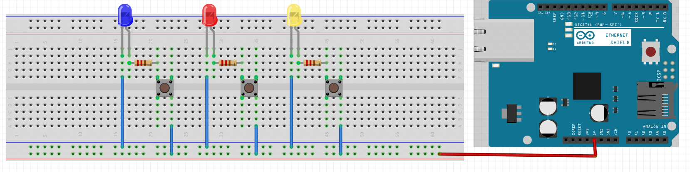
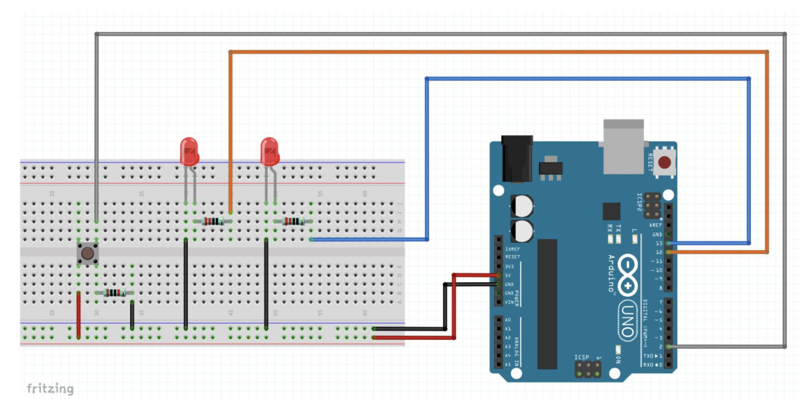
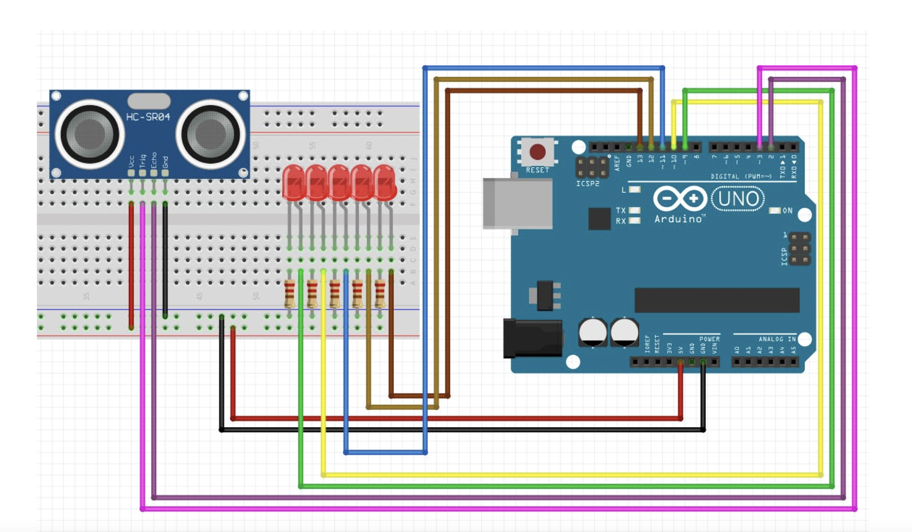
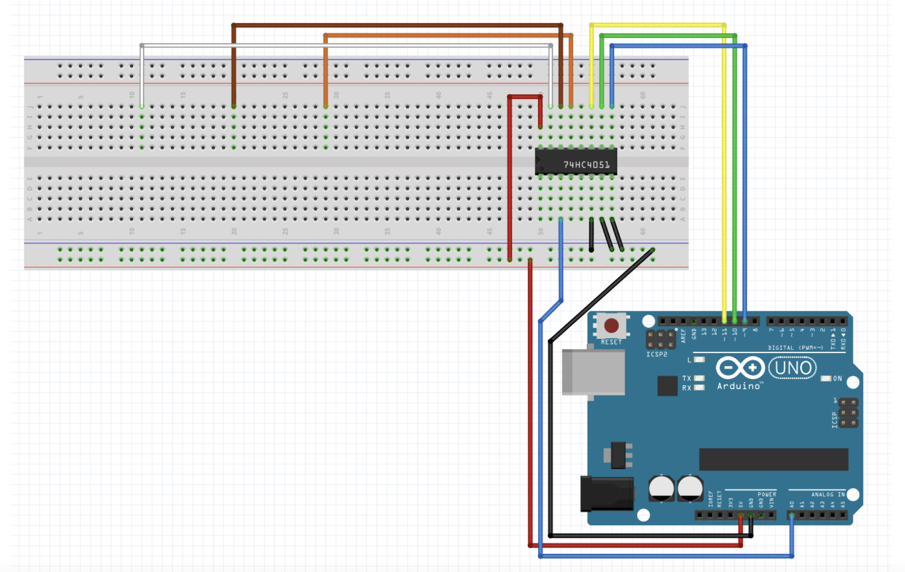
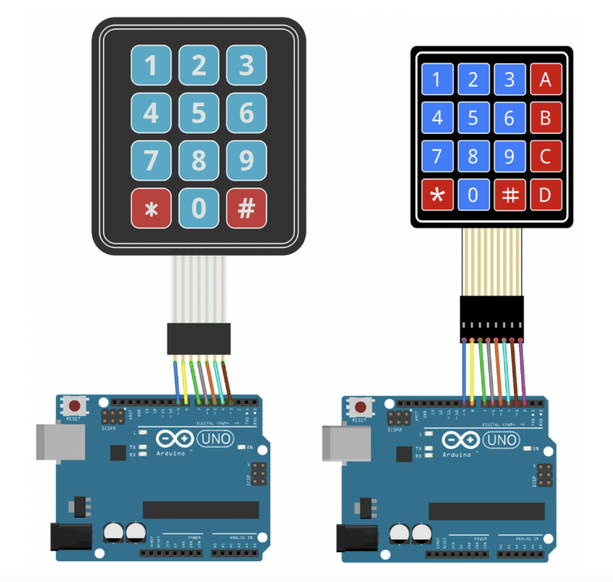
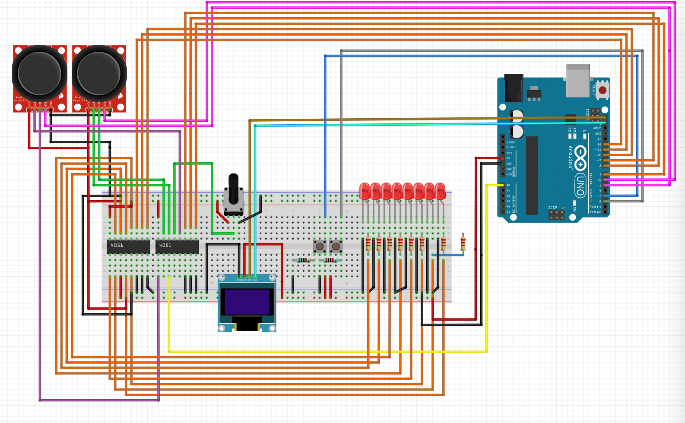
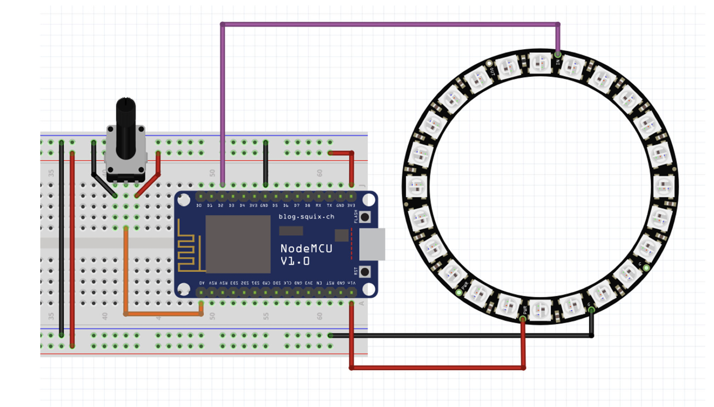

# Logbook - Computer Systems  
  
### Name: Yuanyuan Wang 
### BCU ID: S21102832
### WTU ID: 2024230307  
  
## Week 1 - Introduction and Setup  
I have downloaded several software and registered succeefully
understanding the function of the software


### Evidence 
*Here you can include pictures of what you have done, you must also include any code that you have done, especially if you have been working on Arduinos or Raspberry Pis*

```c 
int code = 1; //If there is code this week, you must include evidence of it. 

if (code == 1){ 
    print("You will get marks for it");
}
else{
    print("You will not get marks for it if you don't include it");
}
```
### Weekly Conclusion 
*The summary of the first week is to download several professional software and have a basic understanding of the use of the software. In this week's homework, GIT software has been used to make things. I hope it can run perfectly in next week's course and get more knowledge and resources.In addition, if you encounter any problems in course homework, you should ask the teacher in time to solve the problems*

# Week 2 - Basic Electornic Components 
Learn how to use circuit tools to make small bulbs light up. You can use series circuits. Study three groups of circuits to make three light bulbs light up


### Evidence 
*week 2-Basic Electornic Components

```c 
int code = 1; //If there is code this week, you must include evidence of it. 

if (code == 1){ 
    print("You will get marks for it");
}
else{
    print("You will not get marks for it if you don't include it");
}
```
### Weekly Conclusion 
*This week, I learned the connection of circuit diagrams and drawing circuit diagrams by fritzing. In class, the teacher gave us some wires, small light bulbs and electric boards for us to connect. The purpose was to make the small light bulbs light up. Finally, we succeeded. After class, use the software to make the circuit diagram, then take the screenshot of the schematic diagram, and finally put it in the logbook to complete the homework*


# Week 3 
Learn Arduino software, input the corresponding code, plug the board into the computer, and finally make the small bulb light up

### Evidence 
week3 Class experiment pictures and code pictures


```c 
int code = 1; //If there is code this week, you must include evidence of it. 

if (code == 1){ 
    print("You will get marks for it");
}
else{
    print("You will not get marks for it if you don't include it");
}
```
### Weekly Conclusion 
*Open the input code with Arduino software. After the circuit diagram is successfully connected, the small bulb lights up and goes dark. Then modify the code to make the two small bulbs light up at the same time. The process of inputting the code is more complex. We failed several times. Finally, we asked the teacher successfully.


## Week 4 - Introduce arduino
know about processor and arduino subsystems


### Evidence 
photos about lecture

```c 
int code = 1; //If there is code this week, you must include evidence of it. 

if (code == 1){ 
    print("You will get marks for it");
}
else{
    print("You will not get marks for it if you don't include it");
}
```
### Weekly Conclusion 
It mainly describes the components and functions of ardino, so that we can have a very clear understanding.


## Week 5 - Circuit operation
P1:Distance Sensors
Part 2 – Potentiometers and Analog Read
Part 3 – Install Required Libraries


### Evidence 
week5 photos

code:
const int buttonPin = 2;
const int ledPin = 13;
boolean b=true;
int buttonState = 0;
void setup() {
  // put your setup code here, to run once:
pinMode(12,OUTPUT);
pinMode(13,OUTPUT);
pinMode(buttonPin,INPUT);
Serial.begin(9600);
}

void loop() {
  // put your main code here, to run repeatedly:
  buttonState = digitalRead(buttonPin);
Serial.println(buttonState);
  if(buttonState == LOW){
digitalWrite(12,b);
digitalWrite(13,!b);
delay(350);
b=!b;
  }
}

code:
int MQ2Pin=A0;
float sensorValue;
#include <SPI.h> // 加载SPI库
#include <Wire.h> // 加载Wire库
#include <Adafruit_GFX.h> // 加载Adafruit_GFX库
#include <Adafruit_SSD1306.h> // 加载Adafruit_SSD1306库

// 定义 OLED屏幕的分辨率
Adafruit_SSD1306 display = Adafruit_SSD1306(128, 64, &Wire);//设置OLED 屏幕。

void setup() {
  // put your setup code here, to run once:
 Serial.begin(9600);
 pinMode(12, OUTPUT);
 pinMode(15, OUTPUT);                     
delay(2000);
display.begin(SSD1306_SWITCHCAPVCC, 0x3C); // 设置OLED的I2C地址
}

void loop() {
  // put your main code here, to run repeatedly:
  sensorValue = analogRead(MQ2Pin);
Serial.print("Sensor Value:");
Serial.println(sensorValue);
 delay(2000);
 
if(sensorValue<160){
  digitalWrite(12,HIGH);
  digitalWrite(15,LOW);
}
else {
  digitalWrite(12,LOW);
  digitalWrite(15,HIGH);
}


display.clearDisplay(); // 清空屏幕

  display.setTextSize(1); // 设置字体大小
  display.setTextColor(SSD1306_WHITE); // 设置字体颜色
  display.setCursor(0,0); // 设置开始显示文字的坐标
  display.print("left-sensor"); // 输出的字符
  display.println(sensorValue);
//   display.print("middle-sensor"); // 输出的字符
//  display.println(sensorvalue2);
//   display.print("right-sensor"); // 输出的字符
//  display.println(sensorvalue3);
  display.display(); // 使更改的显示生效
}

```c 
int code = 1; //If there is code this week, you must include evidence of it. 

if (code == 1){ 
    print("You will get marks for it");
}
else{
    print("You will not get marks for it if you don't include it");
}
```
### Weekly Conclusion 
This week, we mainly talked about the experiment of a small wet bulb lit up by an object approaching the sensor. Then connect the electric board according to the picture given by the teacher, and finally use ardino to light the small bulb


## Week 6 - Sensor experimnet
### Evidence 
code:
int v1=11;
int v2=10;
int v4=9;
void setup() {
  // put your setup code here, to run once:
pinMode(v1,OUTPUT);
pinMode(v2,OUTPUT);
pinMode(v4,OUTPUT);
Serial.begin(9600);
}

void loop() {
  // put your main code here, to run repeatedly:
multi(LOW,HIGH,LOW);//x2 no1
int sensorvalue1=analogRead(A0);
Serial.print("最左边的传感器:");
Serial.println(sensorvalue1);
delay(500);
multi(LOW,LOW,HIGH);//x4 no2
int sensorvalue2=analogRead(A0);
Serial.print("中间的传感器:");
Serial.println(sensorvalue2);
delay(500);
multi(LOW,HIGH,HIGH);//x6 no3
int sensorvalue3=analogRead(A0);
Serial.print("最右边的传感器6  6 6 6:");
Serial.println(sensorvalue3 );
delay(500);
}

void multi(bool x,bool y,bool z){
  digitalWrite(v1,x);
   digitalWrite(v2,y);
    digitalWrite(v4,z);
  
  
  }
week6 photos

```c 
int code = 1; //If there is code this week, you must include evidence of it. 

if (code == 1){ 
    print("You will get marks for it");
}
else{
    print("You will not get marks for it if you don't include it");
}
```
### Weekly Conclusion 
After connecting the circuit, close to the reactor with a lighter, the small bulb will light up and ultraviolet radiation.


## Week 7 - Keyboard principle
Connect the keyboard to Arduino and enter the code to run


### Evidence 
week7 photos


```c 
int code = 1; //If there is code this week, you must include evidence of it. 

if (code == 1){ 
    print("You will get marks for it");
}
else{
    print("You will not get marks for it if you don't include it");
}
```
### Weekly Conclusion 
1. How to use 4x3 keyboard 2. Display information from keyboard in serial monitor 3. Display information from keyboard on OLED screen


Week 9and week 10 - Sensor experiment

Smoke sensor烟雾传感器 Use a match or lighter to approach the sensor, and the small bulb will light up

Evidence

week9 and week10 photos

code： int MQ2Pin=A0; float sensorValue;

void setup() { // put your setup code here, to run once: Serial.begin(9600);

delay(2000); }

void loop() { // put your main code here, to run repeatedly: sensorValue = analogRead(MQ2Pin); Serial.print("Sensor Value:"); Serial.print(sensorValue); delay(2000); }

#include <ESP8266WiFi.h> #include <WiFiClient.h> #include <ESP8266WebServer.h>

// Replace with your network credentials const char* ssid = "Kikiissmart"; const char* password = "HX2001..";

ESP8266WebServer server(80); //instantiate server at port 80 (http port)

String page = ""; double data;

void setup(void){

pinMode(A0, INPUT);

delay(1000); Serial.begin(115200); WiFi.begin(ssid, password); //begin WiFi connection Serial.println(""); int i=0; // Wait for connection while (WiFi.status() != WL_CONNECTED) { delay(1000); Serial.println(i++); } Serial.println(""); Serial.print("Connected to "); Serial.println(ssid); Serial.print("IP address: "); Serial.println(WiFi.localIP()); server.on("/", { page = "

wangyiduo

shuzhi:

"+String(data)+"

"; server.send(200, "text/html", page); });
server.begin(); Serial.println("Web server started!"); }

void loop() { // put your main code here, to run repeatedly: data = analogRead(A0); delay(1000); server.handleClient(); }

int code = 1; //If there is code this week, you must include evidence of it. 

if (code == 1){ 
    print("You will get marks for it");
}
else{
    print("You will not get marks for it if you don't include it");
}
Weekly Conclusion

General information about nodemcu Library ·How to install an esp8266 based board on Arduino IDE ·How to program nodes on the arduin IDE ·Introduce a development board that can be used to replace nodemocu

## Week 9and10 - Keyboard principle
Smoke sensor烟雾传感器 Use a match or lighter to approach the sensor, and the small bulb will light up


### Evidence 
week9nd 10 photos



code： int MQ2Pin=A0; float sensorValue;

void setup() { // put your setup code here, to run once: Serial.begin(9600);

delay(2000); }

void loop() { // put your main code here, to run repeatedly: sensorValue = analogRead(MQ2Pin); Serial.print("Sensor Value:"); Serial.print(sensorValue); delay(2000); }

#include <ESP8266WiFi.h> #include <WiFiClient.h> #include <ESP8266WebServer.h>

// Replace with your network credentials const char* ssid = "Kikiissmart"; const char* password = "HX2001..";

ESP8266WebServer server(80); //instantiate server at port 80 (http port)

String page = ""; double data;

void setup(void){

pinMode(A0, INPUT);

delay(1000); Serial.begin(115200); WiFi.begin(ssid, password); //begin WiFi connection Serial.println(""); int i=0; // Wait for connection while (WiFi.status() != WL_CONNECTED) { delay(1000); Serial.println(i++); } Serial.println(""); Serial.print("Connected to "); Serial.println(ssid); Serial.print("IP address: "); Serial.println(WiFi.localIP()); server.on("/", { page = "

wangyiduo

shuzhi:

"+String(data)+"

"; server.send(200, "text/html", page); });
server.begin(); Serial.println("Web server started!"); }

void loop() { // put your main code here, to run repeatedly: data = analogRead(A0); delay(1000); server.handleClient(); }

int code = 1; //If there is code this week, you must include evidence of it. 

if (code == 1){ 
    print("You will get marks for it");
}
else{
    print("You will not get marks for it if you don't include it");
}
```c 
int code = 1; //If there is code this week, you must include evidence of it. 

if (code == 1){ 
    print("You will get marks for it");
}
else{
    print("You will not get marks for it if you don't include it");
}
```
### Weekly Conclusion
Weekly Conclusion

Enter a file using a CD

The new file generated is Nano

The run file is pl

Ctrl + x is quit

Creating a new file is Mkdir


## Week 13 - Raspberry pie

Use the display screen to verify yourself according to the teacher's code

### Evidence 
week13 photos



```c 
int code = 1; //If there is code this week, you must include evidence of it. 

if (code == 1){ 
    print("You will get marks for it");
}
else{
    print("You will not get marks for it if you don't include it");
}
```
### Weekly Conclusion 
Enter a file using a CD

The new file generated is Nano

The run file is pl

Ctrl + x is quit

Creating a new file is Mkdir